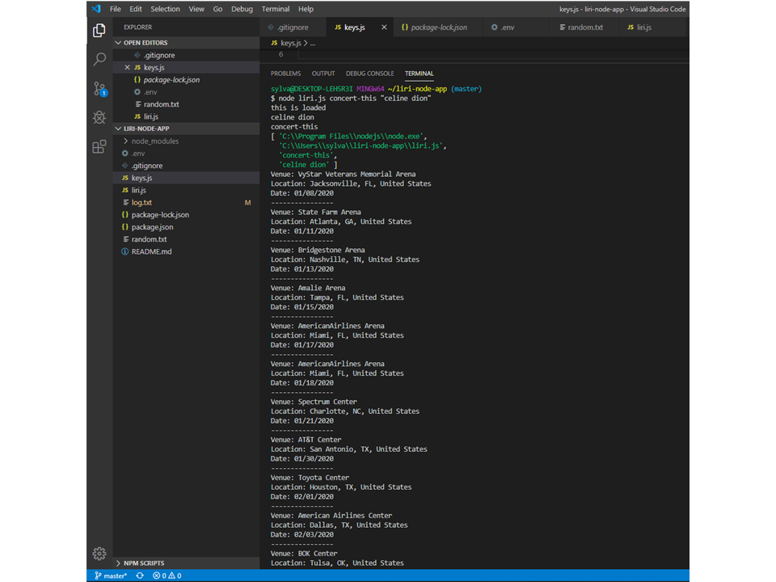
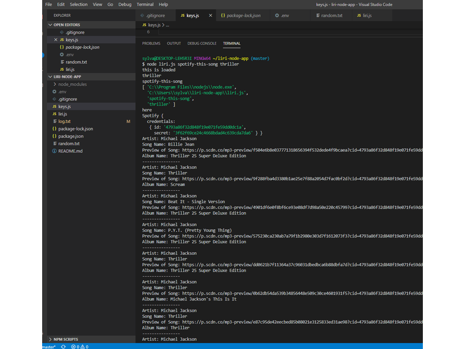
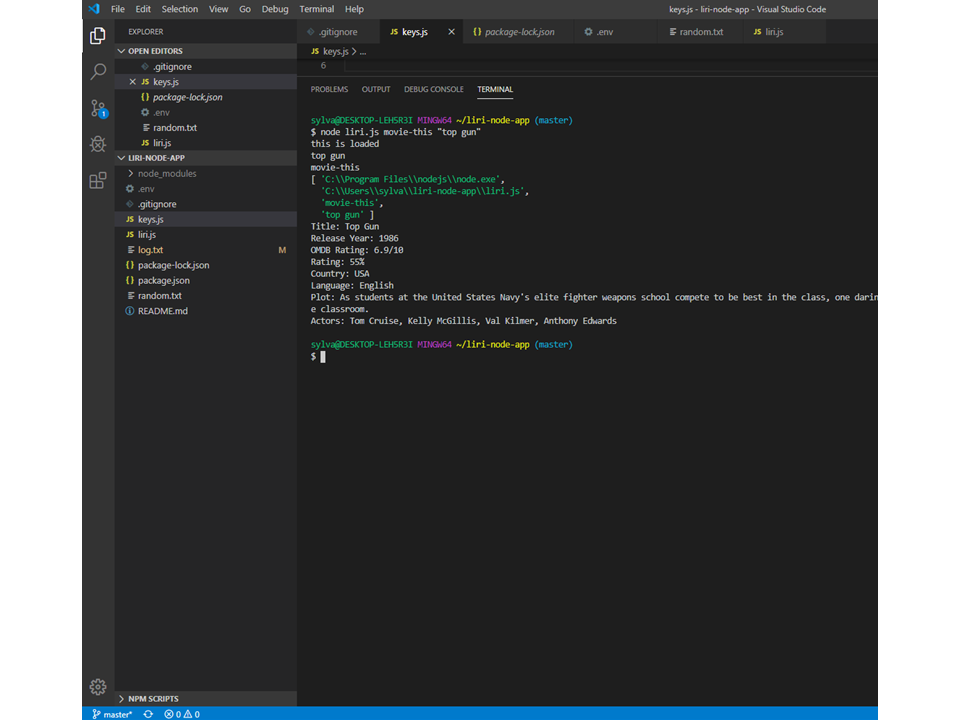

# liri-node-app #

## About ##
LIRI is a Language Interpretation and Recognition Interface. LIRI will be a command line node app that takes in parameters and gives you back data. (Siri knock-off)

## What it does ##
LIRI will search Spotify for songs, Bands in Town for concerts, and OMDB for movies.

## Demo ##
Liri Demo (https://github.com/frenchie85/liri-node-app)

### Bands in Town ###
node liri.js concert-this <insert Twitter handle>

This will search the Bands in Town Artist Events API for an artist and render the following information about each event to the terminal:

Name of the venue

Venue location

Date of the Event (use moment to format this as "MM/DD/YYYY")

### Spotify ####
node liri.js spotify-this-song <insert song title>

This will show the following information about the song in your terminal/bash window

Artist(s)

The song's name

A preview link of the song from Spotify

The album that the song is from

You will utilize the node-spotify-api package in order to retrieve song information from the Spotify API.

The Spotify API requires you sign up as a developer to generate the necessary credentials. You can follow these steps in order to generate a client id and client secret:

Step One: Visit https://developer.spotify.com/my-applications/#!/

Step Two: Either login to your existing Spotify account or create a new one (a free account is fine) and log in.

Step Three: Once logged in, navigate to https://developer.spotify.com/my-applications/#!/applications/create to register a new application to be used with the Spotify API. You can fill in whatever you'd like for these fields. When finished, click the "complete" button.

Step Four: On the next screen, scroll down to where you see your client id and client secret. Copy these values down somewhere, you'll need them to use the Spotify API and the node-spotify-api package.

If no song is provided then your program will default to "The Sign" by Ace of Base

### Movies ###
node liri.js movie-this <insert movie title>

This will output the following information to your terminal/bash window:

 * Title of the movie.
 * Year the movie came out.
 * IMDB Rating of the movie.
 * Rotten Tomatoes Rating of the movie.
 * Country where the movie was produced.
 * Language of the movie.
 * Plot of the movie.
 * Actors in the movie.
If the user doesn't type a movie in, the program will output data for the movie 'Mr. Nobody.'

You'll use the axios package to retrieve data from the OMDB API. Like all of the in-class activities, the OMDB API requires an API key. You may use trilogy.

### Do What It Says ###
node liri.js do-what-it-says

Using the fs Node package, LIRI will take the text inside of random.txt and then use it to call one of LIRI's commands.

It should run spotify-this-song for "I Want it That Way," as follows the text in random.txt.

Edit the text in random.txt to test out the feature for movie-this and concert-this.

## Technologies used ##
Spotify API
OMDB API
Bands In Town API
Node.js
Javascript
NPM packages

## Authors ##
Sylvain David